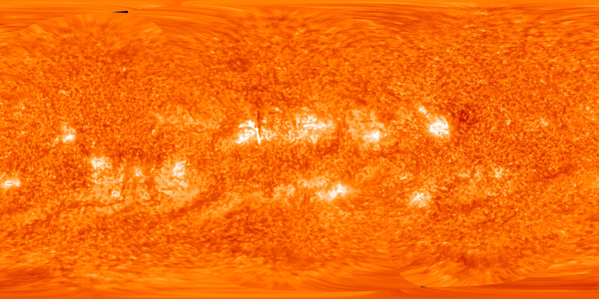

# ⚡ HELIOS-LINK v2.0
**Space-Based Solar Power (SBSP) Mission Control Simulation**

 *(Illustration)*

**HELIOS-LINK** is a high-fidelity, cinematic 3D simulation platform designed for hackathon-level presentations. It demonstrates the conceptual mechanics of Space-Based Solar Power (SBSP) by placing users inside a realistic, real-time "Mission Control" dashboard. 

The application blends stunning photorealistic orbital mechanics running on a custom 3D web engine with an ultra-modern glassmorphism UI, giving users the power to lock a Geostationary satellite to a target city and command a microwave energy transmission beam down to Earth.

---

## 🚀 Features

### 🌌 Cinematic 3D Solar System rendering
- **Photorealistic Sun**: Employs NASA equirectangular surface mapping interwoven with procedural additive-blending corona layers to simulate active, swirling solar flares.
- **Heliocentric Orbital Physics**: Earth genuinely revolves around the Sun on a visible planetary orbit ring, shifting sunlight dynamically.
- **Dynamic Earth Shader**: Incorporates high-resolution day maps, specular ocean reflections, and night-lights that react accurately to the Sun's position.

### 🛰️ SBSP Mechanics & Orbit Locking
- **Realistic Orbit**: Detailed Geostationary (GEO) orbit ring visualization.
- **Live Target Tracking**: Uses planetary coordinates inside the physics engine. As the Earth revolves through space, the Satellite perfectly tracks and leads its transmission beam to the selected city.
- **Ultraviolet Energy Beam**: A highly customized, pulsing, translucent core beam simulating microwave power transmission from the satellite array to Earth's rectenna.

### 🎛️ Mission Control Dashboard
- **Glassmorphism UI**: Built with pure Tailwind CSS using deep neon-cyan accents and blurred backgrounds to create a state-of-the-art telemetry deck.
- **Live Telemetry & Console**: State-driven data panels showcasing live power budgets, energy output, link efficiency, and an auto-scrolling system command terminal.
- **Cinematic Zero-UI Mode**: A one-click toggle drops the dashboard away entirely and unchains the camera, letting users freely zoom to the Sun or pan across the orbit using standard 3D controls.

---

## 🛠️ Technology Stack

- **Framework**: [React 18](https://reactjs.org/) powered by [Vite](https://vitejs.dev/) for extremely fast HMR.
- **Styling**: [Tailwind CSS v3.4](https://tailwindcss.com/) (Pinned for configuration stability).
- **3D Engine**: [Three.js](https://threejs.org/) implemented via [@react-three/fiber](https://docs.pmnd.rs/react-three-fiber).
- **Camera & Helpers**: [@react-three/drei](https://github.com/pmndrs/drei) (Featuring `CameraControls` for seamless cinematic tracking).
- **Post-Processing**: `@react-three/postprocessing` (Provides the intense optical HDR Bloom effects).
- **State Management**: [Zustand](https://github.com/pmndrs/zustand) for bridging the React UI layer with the 3D physics engine seamlessly.

---

## ⚙️ Installation & Usage

### 1. Prerequisites
Ensure you have Node.js and NPM installed on your machine.

### 2. Clone the Repository
```bash
git clone https://github.com/aditya-dev-projects/Helios-link-v2.0.git
cd Helios-link-v2.0
```

### 3. Install Dependencies
```bash
npm install
```

### 4. Run the Development Server
```bash
npm run dev
```
The simulation will instantly launch on `http://localhost:5173`. 

---

## 🎮 Controls
- **Left Click & Drag**: Rotate / Orbit Camera.
- **Right Click & Drag**: Free Pan (Figma-style).
- **Mouse Wheel**: Zoom in/out (Unrestricted limits, zoom out to view the entire solar system).
- **⛶ Cinematic Mode**: Located top-center. Hides the UI and requests browser full-screen. Press `Esc` or the on-screen button to exit.

---

## 📁 Source Architecture
```text
/src
├── components/
│   ├── panels/            # UI Overlay components (Input, Metrics, Console)
│   └── simulation/        # Three.js 3D Components (Earth, Sun, Beam, Satellite)
├── store/
│   └── simulationStore.js # Zustand central nervous system bridging DOM and WebGL
├── App.jsx                # Router & Theme wrapper
├── index.css              # Custom font and tailwind imports
└── pages/
    └── Simulation.jsx     # The primary assembler grouping the 3D scene & UI
```

---

*Built for Hackathon Innovation.* ⚡
